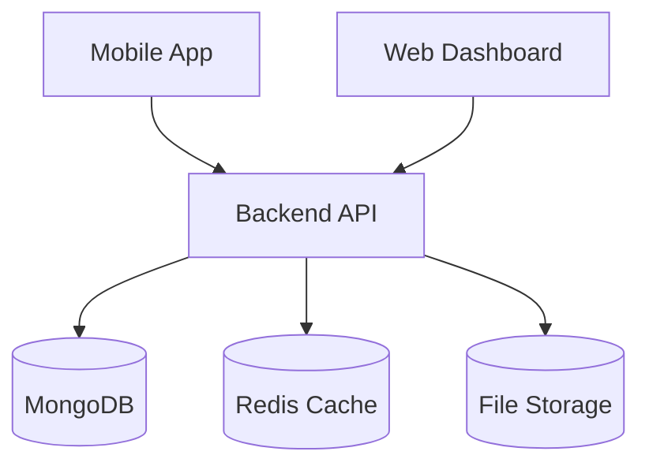
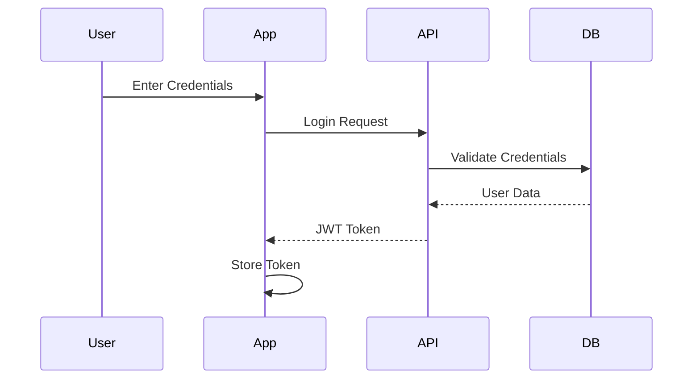
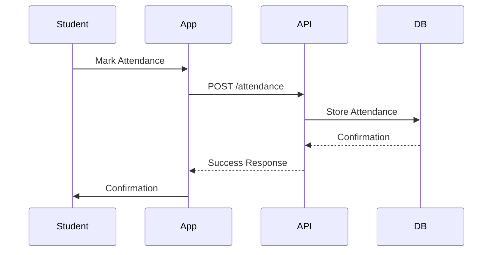
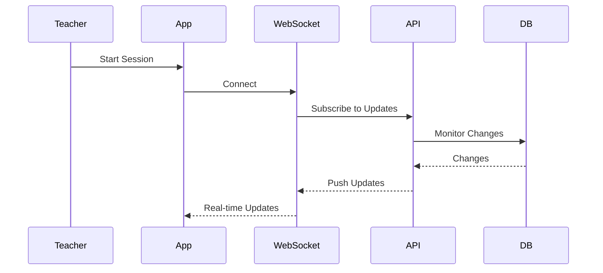

# System Architecture

## Overview

The Unizik Attendance Management System is built using a microservices-based architecture with the following main components:

## Core Components

### 1. Mobile Application
- React Native + Expo application
- Handles student and teacher interactions
- Manages biometric authentication
- Provides real-time attendance tracking

### 2. Backend API
- Node.js + Express application
- RESTful API design
- JWT-based authentication
- Real-time WebSocket connections

### 3. Database
- MongoDB for persistent storage
- Prisma as ORM
- Redis for caching and real-time features

## System Design Patterns

### Authentication Flow

### Attendance Marking Flow

### Real-time Updates Flow

## Security Architecture

### Authentication
- JWT-based token system
- Refresh token rotation
- Biometric authentication integration
- Role-based access control (RBAC)

### Data Protection
- End-to-end encryption for sensitive data
- Secure storage of biometric templates
- Rate limiting and request throttling
- Input validation and sanitization

## Performance Optimization

### Caching Strategy
- Redis cache for frequent queries
- In-memory caching for session data
- Cache invalidation patterns
- Response caching

### Database Optimization
- Indexed queries
- Connection pooling
- Query optimization
- Data partitioning

## Scalability

### Horizontal Scaling
- Load balancer configuration
- Multiple API instances
- Database replication
- Cache distribution

### Vertical Scaling
- Resource optimization
- Memory management
- Connection pooling
- Query optimization